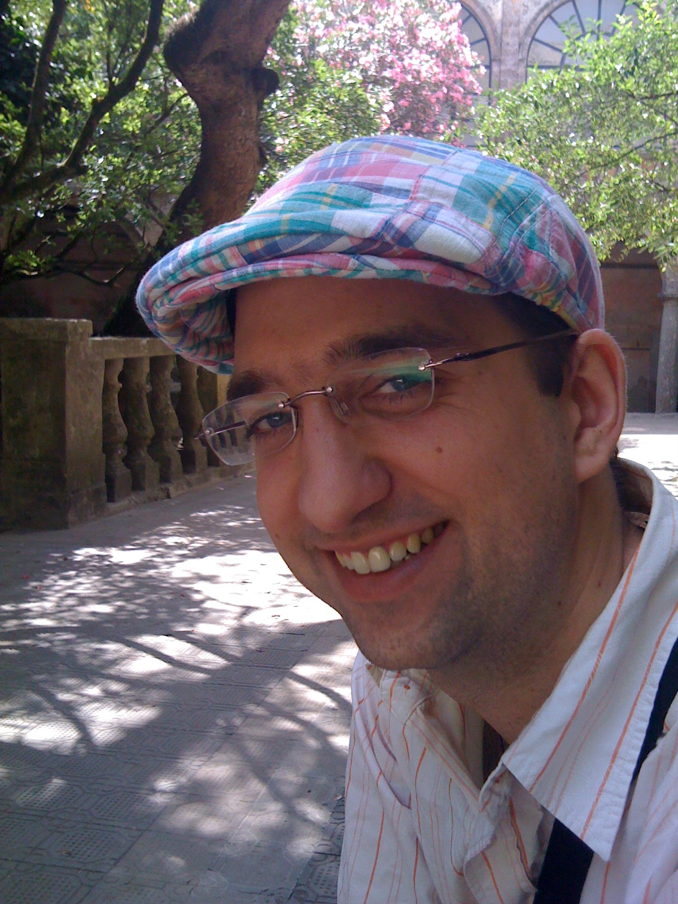
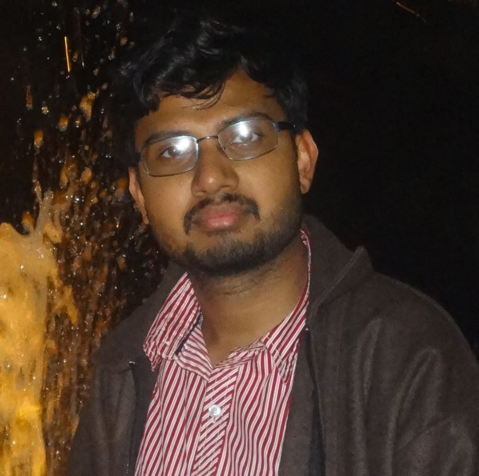

## Group Leader
 <!-- height="240" width="180" -->
<a href="lawler.html">Michael J. Lawler</a> (Assistant Professor) 

## Pictures of us
 
From left to right:
- Todd Rutkowski (Binghamton Graduate)
- Patrick O'Brien (Binghamton Graduate)
- Kyle G. Sherman (Binghamton Graduate)

 <!-- height="190" width="189" -->

## Our Graduate Students
- Eric Aspling (Binghamton Graduate
- Mabrur Ahmed (Binghamton Graduate)
- Gaurav Gyawali (Cornell Graduate)
- Po-Wei Lo (Cornell Graduate)
- Kyle G. Sherman (Binghamton Graduate)

## Former Group Members</h2>
- Krishanu Roychowdury (Cornell Postdoc)
- Todd Rutkowski (Binghamton Graduate)
- Patrick O'Brien (Binghamton Graduate)
- Junping Shao (Binghamton Graduate)
- Ian MacCormack (Cornell Undergraduate)
- Benjamin Sung (Cornell Undergraduate)
- Ashwathi Iyer (Cornell Undergraduate)
- Nina Pikula (Binghamton Undergraduate)
- Belinda Pang (Cornell Undergraduate)
- Steven Collazos (Binghamton Undergraduate)
- Junping Shao (Cornell Undergraduate, Binghamton Graduate)
